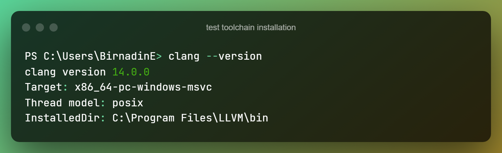

# Setting Development Environment

You can't just start developing a C program right away(sometimes you can 😁). You need to setup your
computer for development. Not only your device but also your workspace, time and even *life*. Thus,
the *Setting Development Environment*.

## Your Device

### Text Editor

Here, *you* means the *developer*. To write source text we need a text editor. You can use anything you want,
but for the sake of unity, let's land on [Visual Studio Code](https://code.visualstudio.com/download) if you have
GUI. If you don't use **Vim** or **Emacs**. Then you can change these into IDEs.

### IDE

You can omit text editor and use any IDE you prefer. Some of my recommendations are:

- [CLion](https://www.jetbrains.com/clion/download/#section=windows) (Cross-Platform) *paid*
- [Visual Studio](https://visualstudio.microsoft.com/downloads/) (if you are on Windows&reg;) *paid/free*
- [Xcode](https://developer.apple.com/xcode/) 🤷‍♂️ (if you are in MacOS) *free*

:::info Your Choice and Concepts
Despite the text-editor/IDE you chose, core concepts apply. As long as you don't do anything
Platform specific!
:::

### Platform

I have been talking about platforms, let me define what I meant.

> **Platform** :- CPU and kernel you use.

:::danger Backward Compatibility
Linux kernel running on [x86](https://en.wikipedia.org/wiki/X86)
CPU but Linux kernel running on [x64](https://en.wikipedia.org/wiki/X86-64)
CPU is different. You can write source text and compile, execute x86 compiled programs in x64 CPU,
but not [vice versa](https://www.studytonight.com/post/x86-vs-x64-what-is-the-difference-between-x86-and-x64-architecture).
This [**is**](https://en.wikipedia.org/wiki/Backward_compatibility)
called `Backward Compatibility`
:::

There lot of platforms available, but despite the variants and varitires, **Learn C** focuses on common functionality
of C in any platforms. And you can follow along with no problems.

### Toolchain

A C source text should be compiled and made an executable before it can be useful. For this purpose we need some tools,
and want to use them in an order to accomplish various tasks, thus Toolchain. As I already stated **Learn C** is platform-independant,
so you can follow with whatever you have! I decided to choose [The LLVM Compiler Infrastructure Project](http://llvm.org/)
as our toolchain. So, let's get this done with💦.

1. Go to [Official GitHub Releases](https://github.com/llvm/llvm-project/releases/latest)
2. Download the artifact you need.
   - e.g. if on GNU linux kernel and x64 OS:clang+llvm-14.0.6-aarch64-linux-gnu.tar.xz
   - e.g. if on MacOS: clang+llvm-14.0.6-x86_64-apple-darwin.tar.xz
   - e.g. if on Windows PC on x64: LLVM-14.0.6-win64.exe
   - or Google `download llvm for --your-platform--`

3. Whatever you do, make sure you have `clang`

To test your toolchain installation, open a terminal and execute `clang --version`.
This is should print version number like so...

If you encounter any problems, please let me know using social media links provided below or in the discussions panel.

### Final Touch Up

Let's Finish with our text-editor. As I told you before, I will use Visual Studio Code as text-editor so that you can follow up
despite your platform, it's even on the browser!

Go ahead and download [C\C++ extension](https://marketplace.visualstudio.com/items?itemName=ms-vscode.cpptools). You don't need this
one neccessarily, but this extension provides Intelli-Sense to make your mental overhead low 🤯!

---

That's it for the environment setup of your device. Go ahead and move on to quick-test the integration of evrything.
