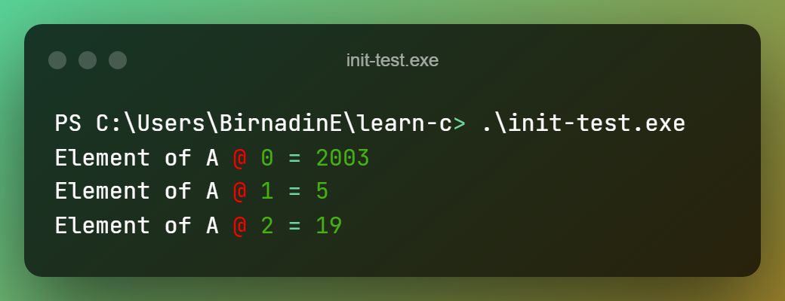
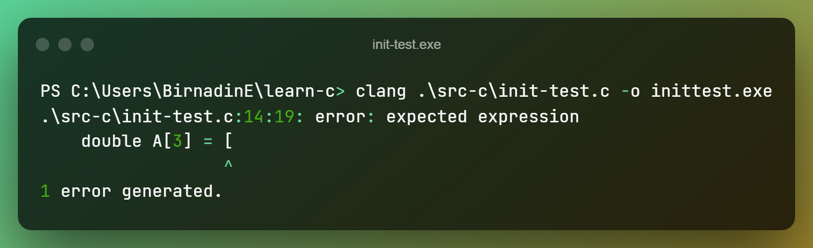

# Testing Development Environment

Let's write a short C-source text to check if everything is working fine.
Don't think too much, just copy-paste the text to check.

```c
/* 
    these 2 lines will ensure your platforms C Library 
    is visible to our compiler, and the platform's
    I/O ops are also available to us
 */
#include <stdio.h>
#include <stdlib.h> 

int main(void)
{
    /*
        this ensures we have modern C in the platform
    */
    double A[3] = {
        [0] = 2003,
        [1] = 5,
        [2] = 19,
    };

    for (size_t i = 0; i < 3; ++i)
    {
       printf("Element of A @ %zu = %g\n", i, A[i]);
    }

    return EXIT_SUCCESS;
}
```

Save the source text. And in your terminal navigate to the director this file was saved.
And execute the following command...

```bash
clang ./name-of-the-file-you-saved.c -o init-test
```

This should not give any output! Then run your executable found in the same directory
just got compiled by clang, named `init-test`. Here's an example to run the executable
in Windows, and its output.



If everything went is alright then move-on 🎉.

## Diagnostics

If you get any errors please Google the error and try to
just read what the results say(ofz omit the ads😉)! See, if you can mitigate the error.

:::tip Clang's Output
Compiler output is also a very useful, especially `clang`. It is fairly verbose by default.
Try to understand it.
:::

### Example

One mistake I made during my first encounter was misusing the brackets.
Be careful with what you type. C-Compilers are picky about syntax!



This tells us at line 14 and colum 19 we have an error. And it expects an expression.
This is vague and actually incorrect suggestion but if compiler can identify what the
problem is then it can correct them also. But that's not the case yet,
may be in **future**!

The problem is, you have swapped `{}` with `[]`. Change it and recompile!

---

**If you are stuck anyways, feel free to get-to-me using any links provided in the footer 👇.**
